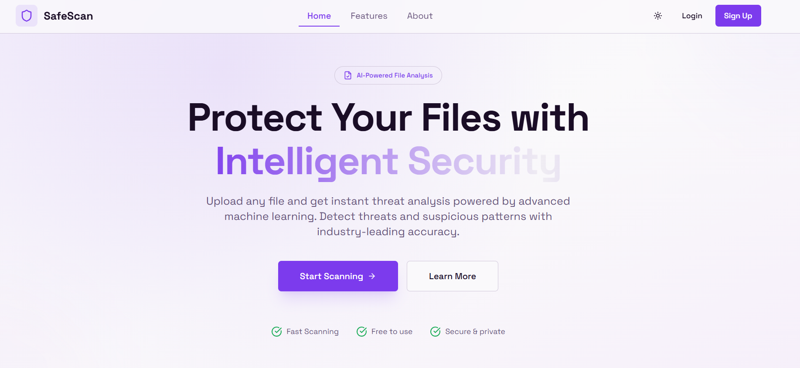
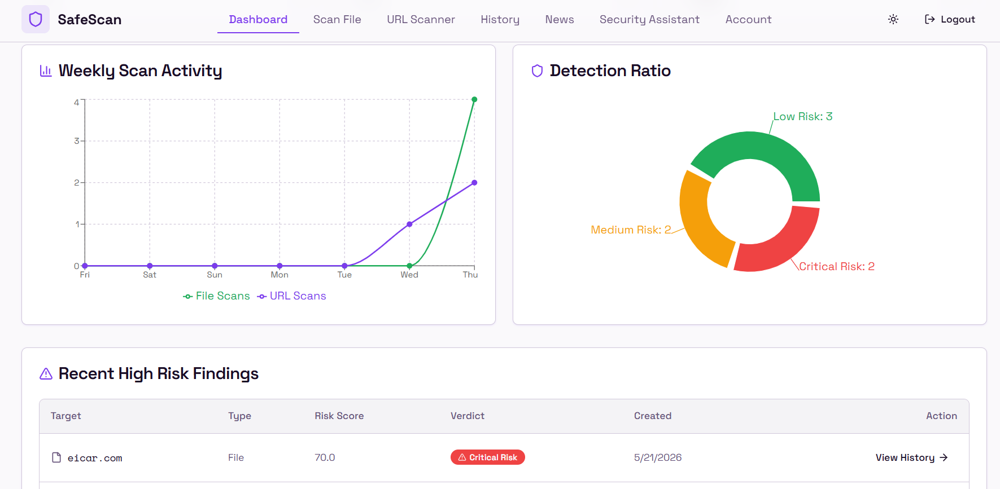
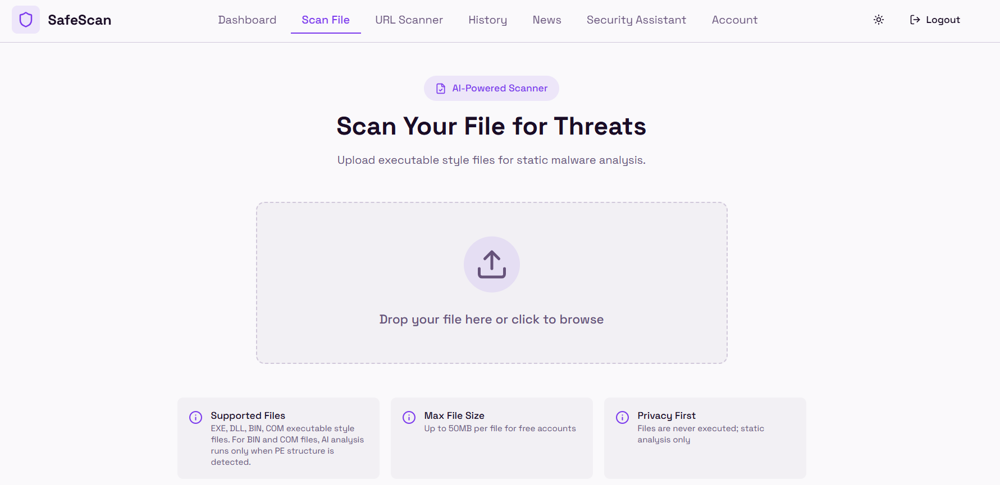
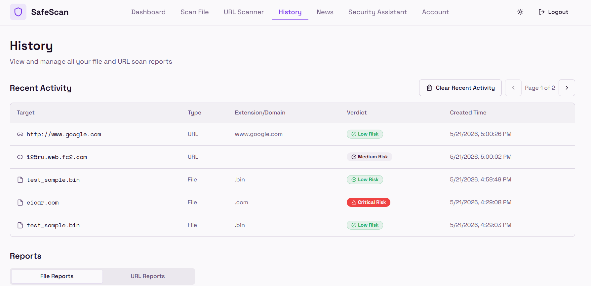
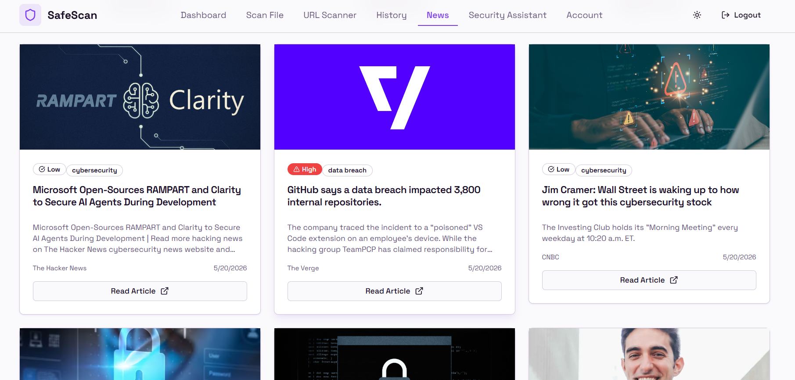
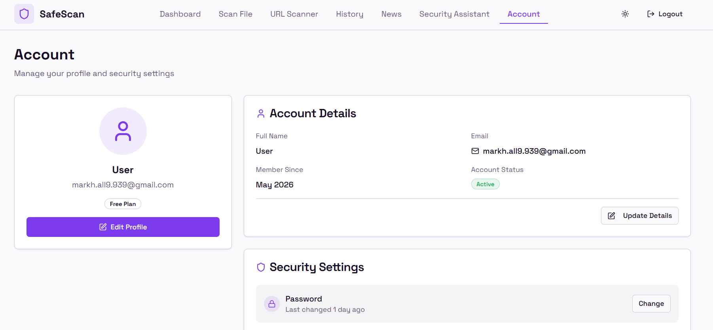

# SafeScan - Hybrid Malware Detection System

A modern, intelligent malware and URL detection system with AI, YARA rules, VirusTotal threat intelligence, and a beautiful React frontend.

---

## 🚀 Features

- **File Scanning**: Scan executable files (EXE, DLL, BIN) using:
  - MalConv AI model
  - YARA rule pattern matching
  - VirusTotal hash lookup
  - Risk scoring engine
- **URL Scanning**: Scan URLs using:
  - Local indicator checks
  - VirusTotal URL lookup
  - Risk scoring
- **Dashboard**: Real-time scan statistics and charts
- **History**: Track all scan reports with detailed views
- **Security Assistant**: AI-powered chatbot for security questions
- **Threat News**: Latest cybersecurity news updates
- **Dark/Light Mode**: Beautiful UI with theme support

---

## 📸 Screenshots

### Home Page


### Dashboard



### File Scanner


### History


### News


### Account


---

## 🛠️ Tech Stack

### Backend
- FastAPI - Modern Python web framework
- SQLite + SQLAlchemy - Database
- JWT - Authentication
- TensorFlow - MalConv AI model
- YARA - Pattern matching
- VirusTotal API - Threat intelligence
- Groq API - Chatbot

### Frontend
- React 18 - UI library
- TypeScript - Type safety
- Tailwind CSS - Styling
- shadcn/ui - UI components
- Recharts - Charts and graphs
- Framer Motion - Animations
- Vite - Build tool

---

## 📦 Setup Instructions

### Prerequisites
- Python 3.9+
- Node.js 18+
- npm or bun

### 1. Clone the Project
```bash
git clone <repository-url>
cd Malware-Detection
```

### 2. Backend Setup

#### Navigate to backend directory
```bash
cd backend
```

#### Create virtual environment
```bash
python -m venv .venv

# Windows
.venv\Scripts\activate

# macOS/Linux
source .venv/bin/activate
```

#### Install dependencies
```bash
pip install -r requirements.txt
```

#### Configure environment
```bash
copy .env.example .env
```

Edit `.env` and set:
```env
SECRET_KEY=your-random-secret-key-here
VIRUSTOTAL_API_KEY=your-virustotal-api-key-here (optional)
GROQ_API_KEY=your-groq-api-key-here (optional)
GNEWS_API_KEY=your-gnews-api-key-here (optional)
```

#### Run backend server
**Windows (important - use this command!):**
```powershell
.\.venv\Scripts\python.exe -m uvicorn app.main:app --reload --host 127.0.0.1 --port 8000
```

**macOS/Linux:**
```bash
uvicorn app.main:app --reload --host 127.0.0.1 --port 8000
```

Backend will be available at: http://localhost:8000

API docs:
- Swagger UI: http://localhost:8000/docs
- ReDoc: http://localhost:8000/redoc

### 3. Frontend Setup

#### Navigate to frontend directory (new terminal)
```bash
cd frontend
```

#### Install dependencies
```bash
npm install
# or
bun install
```

#### Run frontend dev server
```bash
npm run dev
# or
bun run dev
```

Frontend will be available at: http://localhost:8080

---

## 🧪 Verification Scripts

All scripts should be run from the `backend/` directory.

### File Scoring Verification
```powershell
.\scripts\verify_file_scoring.ps1
```

### Phase 1: Auth & Upload
```powershell
.\scripts\verify_phase1.ps1
```

### Phase 2: YARA Rules
```powershell
.\scripts\verify_phase2.ps1
```

### Phase 3: VirusTotal
```powershell
.\scripts\verify_phase3.ps1
```

### Phase 4: MalConv AI
```powershell
.\scripts\verify_phase4.ps1
```

### Phase 5: Risk Scoring
```powershell
.\scripts\verify_phase5.ps1
```

### Phase 6: URL Scanning
```powershell
.\scripts\verify_url_scan.ps1
```

### Phase 7: Chatbot
```powershell
.\scripts\verify_chat.ps1
```

---

## 📁 Project Structure

```
Malware-Detection/
├── backend/                 # FastAPI backend
│   ├── app/
│   │   ├── routes/         # API endpoints
│   │   ├── services/       # Business logic
│   │   └── yara_rules/     # YARA rule files
│   ├── scripts/            # Verification scripts
│   └── uploads/            # Uploaded files (gitignored)
├── frontend/                # React frontend
│   ├── src/
│   │   ├── components/     # UI components
│   │   ├── pages/          # Page components
│   │   ├── services/       # API services
│   │   └── lib/            # Utilities
│   └── public/             # Static assets
├── images/                  # Project screenshots
└── README.md
```

---

## 🎨 Design Features

- Beautiful gradient backgrounds
- Smooth animations with Framer Motion
- Responsive design for all screen sizes
- Dark/Light theme support
- Clean, modern UI with shadcn/ui components
- Interactive charts with Recharts

---

## 🔒 Security

- Files are never executed - only static analysis
- Uploaded files are stored locally (not sent to VirusTotal)
- Only SHA256 hashes are sent to VirusTotal
- JWT authentication for all protected endpoints
- Guardrails to prevent harmful questions from chatbot

---

## 📚 API Endpoints

### Authentication
- `POST /auth/signup` - Register new user
- `POST /auth/login` - Login and get JWT token
- `GET /auth/me` - Get current user profile

### Scanning
- `POST /scan/file` - Scan a file
- `POST /scan/url` - Scan a URL

### Reports
- `GET /reports/` - List file reports
- `GET /reports/{id}` - Get single file report
- `DELETE /reports/{id}` - Delete file report
- `POST /reports/delete-selected` - Delete selected file reports
- `DELETE /reports/clear` - Clear all file reports
- `GET /url-reports/` - List URL reports
- `GET /url-reports/{id}` - Get single URL report
- `DELETE /url-reports/{id}` - Delete URL report
- `POST /url-reports/delete-selected` - Delete selected URL reports
- `DELETE /url-reports/clear` - Clear all URL reports

### Chatbot
- `POST /chat/report/file/{id}` - Explain file report
- `POST /chat/report/url/{id}` - Explain URL report
- `POST /chat/guard` - Guarded chat

### News
- `GET /news` - Get latest cybersecurity news

---

## 📋 License

This project is for educational purposes.

---

## 🙏 Acknowledgments

- MalConv model from Hugging Face
- VirusTotal API for threat intelligence
- YARA for pattern matching
- Groq for chatbot
- GNews for news updates
- shadcn/ui for UI components
