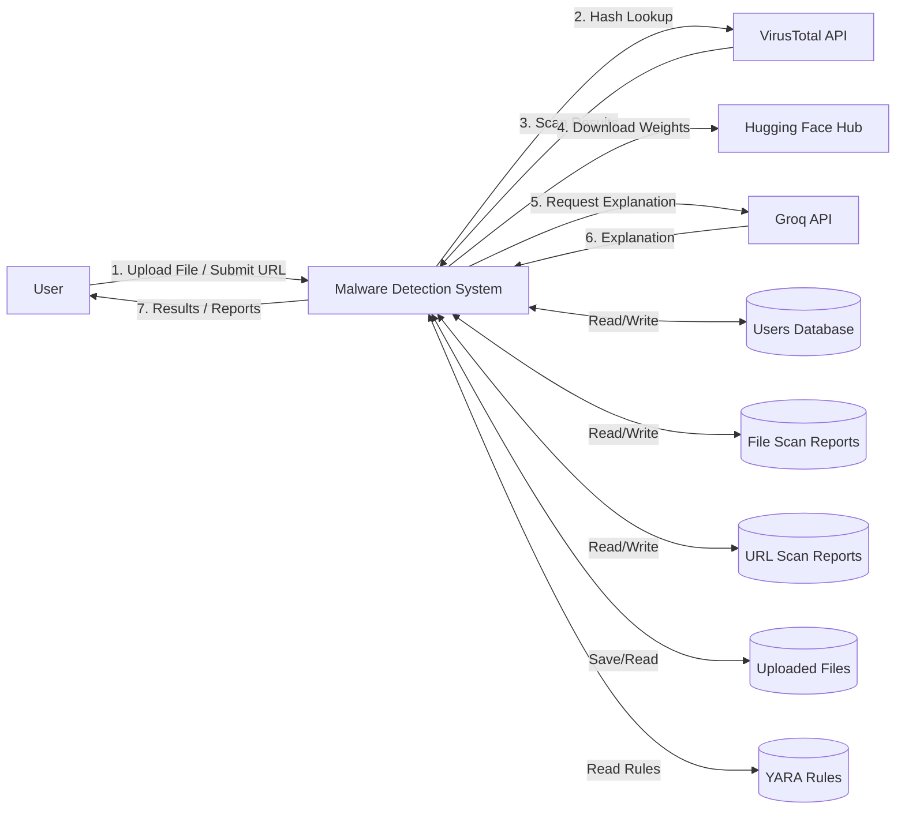
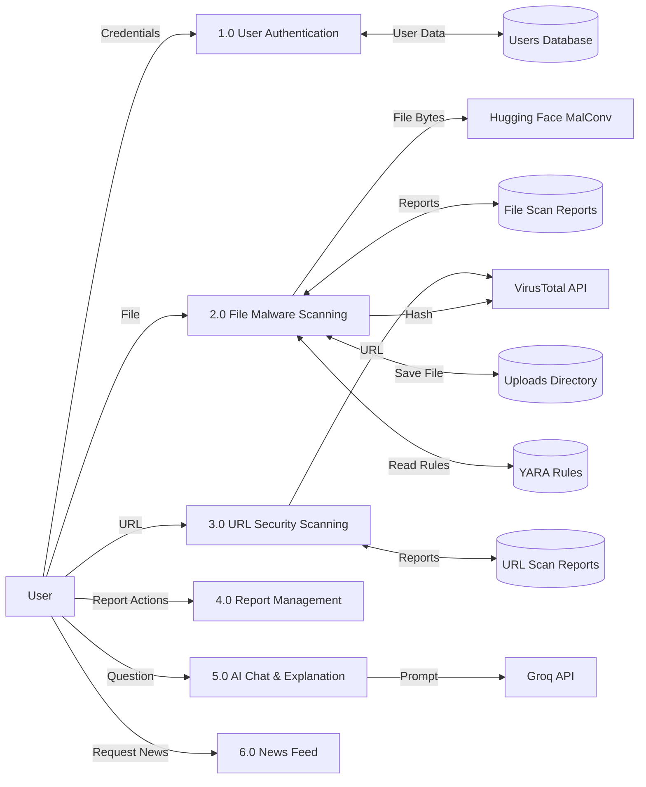
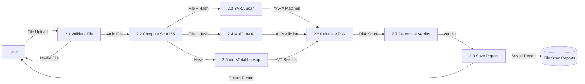
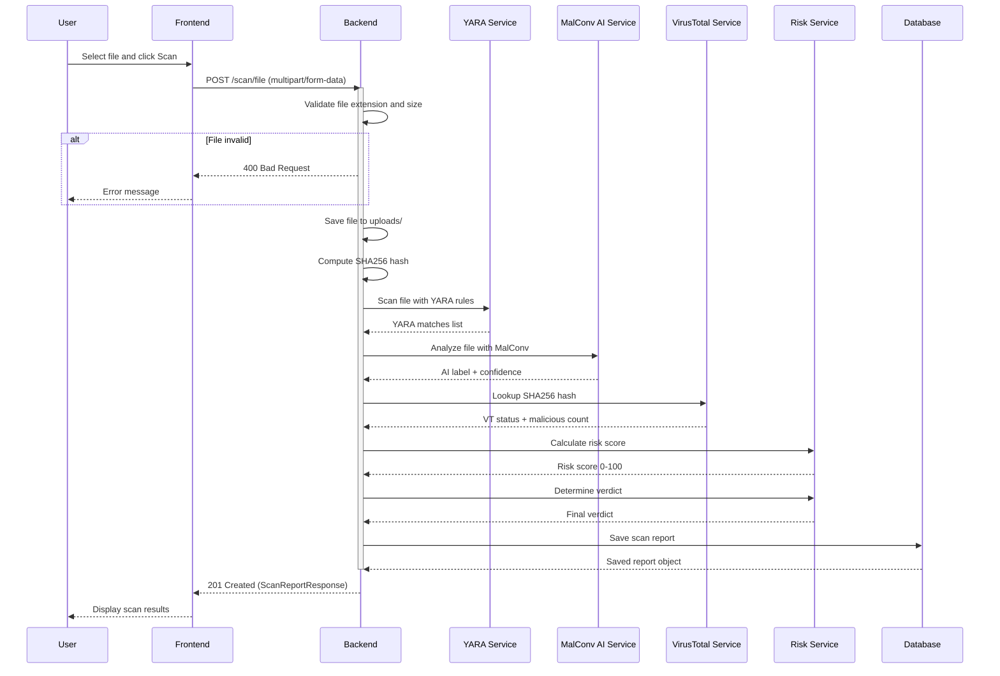
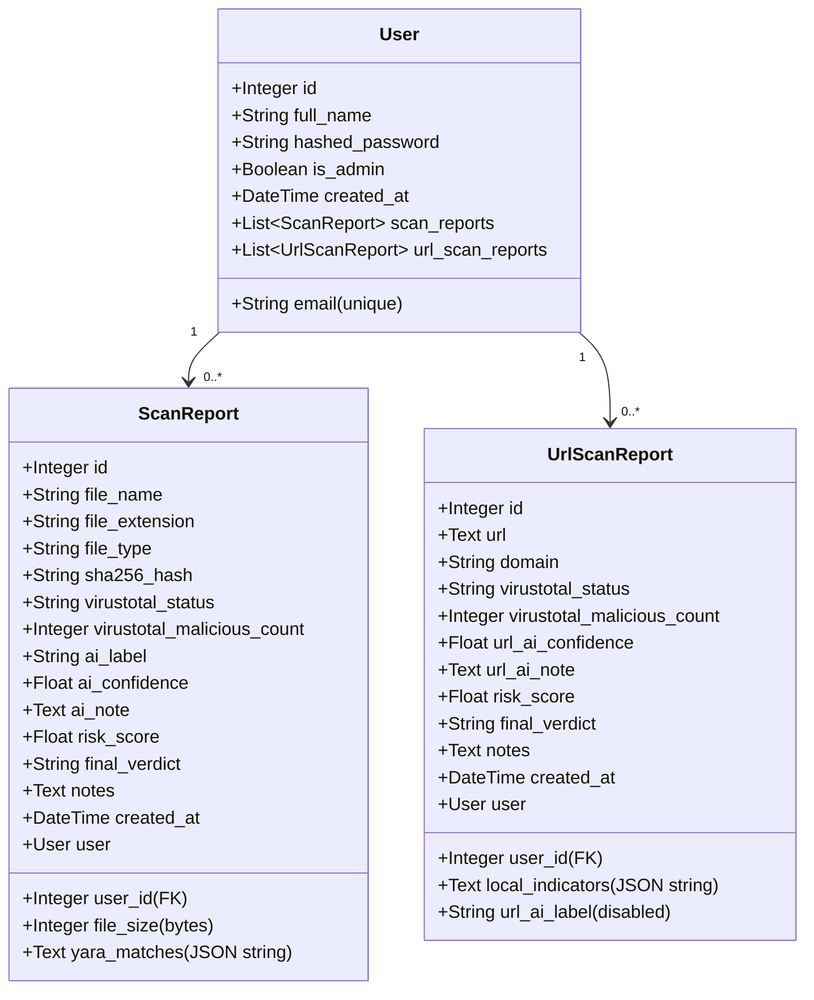
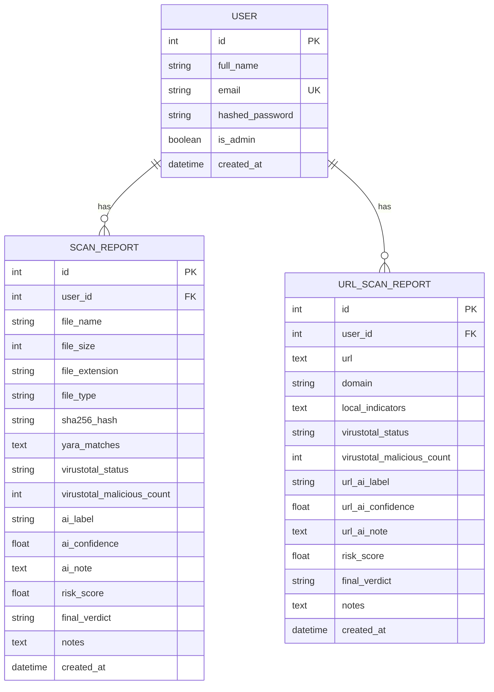

# Malware Detection System - Report Data README
> Generated for Final Year Project (FYP) Documentation
> University of Agriculture Faisalabad (UAF)

---

## SECTION 1: CHAPTER 1 - INTRODUCTION DATA

### Project Overview
This is a **Hybrid Malware Detection System** built with a modern web stack:
- **Frontend**: React + TypeScript + Vite + Tailwind CSS + shadcn/ui
- **Backend**: FastAPI (Python) + SQLAlchemy ORM + SQLite Database
- **Analysis Technologies**: YARA rules, VirusTotal API v3, MalConv deep learning model, Groq LLM

The system provides:
- File scanning for malware detection
- URL security scanning
- AI-powered report explanations
- Scan history management
- Security news feed
- Security assistant chatbot

### Functional Requirements (FRs)

#### FR01: User Authentication
- ✅ **Registration**: Create new user accounts with full name, email, and password
- ✅ **Login**: Authenticate existing users and return JWT tokens
- ✅ **JWT Handling**: Token-based authentication for API access
- ✅ **Profile**: Get current authenticated user profile
- ✅ **Validation**: Password hashing (bcrypt), email format validation, unique email check

#### FR02: File Malware Scanning
- ✅ **File Upload**: Accept file uploads from frontend
- ✅ **File Validation**: Check allowed extensions (.exe, .dll, .bin, .com) and max size (50MB)
- ✅ **PE Validation**: Verify file is a valid Windows PE executable (MZ and PE signatures)
- ✅ **YARA Scanning**: Pattern matching using compiled YARA rules
- ✅ **AI Analysis**: MalConv deep learning model for static analysis
- ✅ **VirusTotal Lookup**: Hash lookup against VirusTotal's 70+ antivirus engines
- ✅ **Risk Scoring**: Evidence-based risk score (0.0 - 100.0)
- ✅ **Verdict Generation**: Final verdict (Low Risk / Medium Risk / High Risk / Critical Risk)
- ✅ **Report Saving**: Persist scan reports to database with user ownership

#### FR03: URL Security Scanning
- ✅ **URL Submission**: Accept URLs from frontend
- ✅ **URL Validation**: Check for valid http/https protocol
- ✅ **Local Indicators**: Check for suspicious patterns (IP as hostname, too many subdomains, @ symbol, suspicious keywords, etc.)
- ✅ **VirusTotal Lookup**: URL lookup against VirusTotal
- ✅ **Risk Scoring**: URL-specific risk scoring
- ✅ **Verdict Generation**: URL-specific final verdict
- ✅ **Report Saving**: Persist URL scan reports to database

#### FR04: Report Management
- ✅ **Report Generation**: Auto-generated during scan
- ✅ **Report Viewing**: View all reports, individual reports
- ✅ **Report Explanation**: AI-powered explanation using Groq LLM
- ✅ **History Management**: Sort reports by date (newest first)
- ✅ **Delete Operations**: Delete single report, delete multiple selected, clear all
- ✅ **Ownership**: Reports are only accessible by their owner

#### FR05: Security Assistant Chatbot
- ✅ **User Query Processing**: Accept user questions
- ✅ **Security Guidance**: Answer security-related questions
- ✅ **Malware Assistance**: Help with malware detection queries
- ✅ **Context Handling**: Accept optional report context
- ✅ **Guardrails**: Block harmful/off-topic questions using keyword filters
- ✅ **Fallbacks**: Local fallback if LLM unavailable

### Non-Functional Requirements (NFRs)

#### Performance
- **Response Times**: 
  - Health check: < 100ms
  - File scan: ~ 1-5 seconds (depends on file size and AI model)
  - URL scan: ~ 1-3 seconds
  - Chat/Report explain: ~ 1-3 seconds
- **File Processing**:
  - Max file size: 50 MB
  - AI model max bytes: 2,000,000 bytes
- **Concurrency**: Async FastAPI with Uvicorn server

#### Scalability
- **Database**: SQLite (local development), easily switchable to PostgreSQL/MySQL via SQLAlchemy
- **File Storage**: Local file system (uploads/)
- **API Design**: RESTful API with stateless authentication

#### Reliability
- **Error Handling**: Graceful error handling with proper HTTP status codes
- **Fallback Mechanisms**:
  - AI scanner: Falls back to "unavailable" if model fails
  - VirusTotal: Falls back to "not_checked" if API key missing or rate-limited
  - Chatbot: Falls back to local answers if Groq API unavailable
  - Reports: Fallback explanations if LLM unavailable

#### Security
- **Authentication**: JWT tokens (HS256 algorithm)
- **Authorization**: Reports only accessible by their owner
- **Passwords**: bcrypt hashing with salt
- **CORS**: Configured to allow specific origins (localhost:3000, 5173, 5174, 8080, 8000)
- **File Safety**: Uploaded files are **NEVER EXECUTED** - only static analysis
- **VirusTotal Safety**: Only SHA256 hash is sent (never the actual file)
- **Environment Variables**: Sensitive config in .env file (not committed)

#### Frontend Responsiveness
- Mobile-first design using Tailwind CSS
- Responsive grid and flex layouts
- Theme support (light/dark)
- Smooth animations and transitions

### Hardware & Software Requirements

#### Client Side
- **Browser Requirements**: Modern web browser (Chrome, Firefox, Safari, Edge)
- **Minimum RAM**: 4 GB (8 GB recommended)
- **Storage**: 500 MB for project files + uploads

#### Backend
- **Python Version**: Python 3.9+ (developed with 3.11+)
- **Dependencies**: Listed in `backend/requirements.txt`:
  - fastapi==0.115.0
  - uvicorn[standard]==0.30.6
  - sqlalchemy==2.0.35
  - python-jose[cryptography]==3.3.0
  - passlib[bcrypt]==1.7.4
  - bcrypt>=3.2.0,<4.0.0
  - email-validator==2.3.0
  - python-dotenv==1.0.1
  - python-multipart==0.0.12
  - pydantic-settings==2.5.2
  - aiofiles==24.1.0
  - yara-python==4.5.4
  - httpx==0.27.2
  - tensorflow==2.21.0
  - keras==3.14.1
  - huggingface-hub==1.15.0
  - numpy==2.4.6

#### Frontend
- **Node.js Version**: 18+ (developed with 20+)
- **Dependencies**: Listed in `frontend/package.json`:
  - React 18.3.1
  - TypeScript 5.8.3
  - Vite 5.4.19
  - Tailwind CSS 3.4.17
  - shadcn/ui components
  - React Router DOM 6.30.1
  - React Query (TanStack Query) 5.83.0
  - Vitest 3.2.4 (testing)
  - Framer Motion 12.27.0 (animations)
  - Lucide React 0.462.0 (icons)

#### Database
- **Default**: SQLite (file-based, `malware_detection.db`)
- **Supported**: PostgreSQL, MySQL, MariaDB (via SQLAlchemy)

#### Development Tools
- VS Code (recommended)
- Git (version control)
- PowerShell 5+ (Windows)
- Postman/Thunder Client (API testing)

---

## SECTION 2: CHAPTER 2 - MATERIALS & METHODS DATA

### Tools & Technologies Dictionary

| Technology | Purpose | Version | Notes |
|------------|---------|---------|-------|
| React | Frontend framework | 18.3.1 | For building UI components |
| TypeScript | Type safety | 5.8.3 | Adds static typing to JavaScript |
| Vite | Build tool | 5.4.19 | Fast development server and bundler |
| Tailwind CSS | CSS framework | 3.4.17 | Utility-first CSS for styling |
| shadcn/ui | UI component library | - | Radix UI + Tailwind components |
| FastAPI | Backend framework | 0.115.0 | Modern, fast Python API framework |
| Uvicorn | ASGI server | 0.30.6 | For running FastAPI |
| SQLAlchemy | ORM | 2.0.35 | Database ORM for models |
| SQLite | Database | 3.x+ | File-based database (default) |
| python-jose | JWT | 3.3.0 | JWT token creation/validation |
| passlib | Password hashing | 1.7.4 | bcrypt password hashing |
| Pydantic | Data validation | 2.x+ | Request/response schemas |
| YARA | Pattern matching | 4.5.4 | Malware pattern detection |
| VirusTotal API v3 | Threat intelligence | - | Hash/URL lookup against 70+ AV engines |
| MalConv | Deep learning | - | Malware detection model from cycloevan/malconv (Hugging Face) |
| TensorFlow | ML framework | 2.21.0 | For MalConv model |
| Keras | High-level ML API | 3.14.1 | Model architecture |
| Hugging Face Hub | Model hosting | 1.15.0 | Download MalConv weights |
| NumPy | Numerical computing | 2.4.6 | Data preprocessing |
| httpx | HTTP client | 0.27.2 | For VirusTotal/Groq API calls |
| Groq API | LLM | - | llama-3.1-8b-instant for chat/report explanation |
| GNews API (optional) | News | - | Cybersecurity news feed |

### Text Maps for Visual Diagrams

#### 1. Use Case Diagram

**Actors**:
- User (Authenticated User)
- Guest (Unauthenticated User)

**Use Cases**:
- Guest: View Home, View Features, View About
- User: Login, Register, Logout, Update Account
- User: Upload File for Scan, View File Scan Results
- User: Submit URL for Scan, View URL Scan Results
- User: View Scan History, View Individual Report, Delete Report(s)
- User: Ask Security Assistant, Get Report Explanation
- User: View Security News

**Mermaid Syntax**:
```mermaid
useCaseDiagram
    actor Guest
    actor User
    
    package "Public Pages" {
        usecase "View Home" as UC1
        usecase "View Features" as UC2
        usecase "View About" as UC3
    }
    
    package "Authentication" {
        usecase "Register" as UC4
        usecase "Login" as UC5
        usecase "Logout" as UC6
        usecase "Manage Account" as UC7
    }
    
    package "File Scanning" {
        usecase "Upload File" as UC8
        usecase "View File Results" as UC9
    }
    
    package "URL Scanning" {
        usecase "Scan URL" as UC10
        usecase "View URL Results" as UC11
    }
    
    package "Report Management" {
        usecase "View History" as UC12
        usecase "View Report" as UC13
        usecase "Delete Report" as UC14
    }
    
    package "AI Features" {
        usecase "Explain Report" as UC15
        usecase "Ask Assistant" as UC16
    }
    
    package "News" {
        usecase "View News" as UC17
    }
    
    Guest --> UC1
    Guest --> UC2
    Guest --> UC3
    Guest --> UC4
    Guest --> UC5
    
    User --> UC6
    User --> UC7
    User --> UC8
    User --> UC9
    User --> UC10
    User --> UC11
    User --> UC12
    User --> UC13
    User --> UC14
    User --> UC15
    User --> UC16
    User --> UC17
```

#### 2. Context Level DFD (Data Flow Diagram)

**Entities**:
- User (External Entity)
- VirusTotal API (External Entity)
- Groq API (External Entity)
- Hugging Face Hub (External Entity)

**Processes**:
- Malware Detection System (Process 0)

**Data Stores**:
- D1: Users Database
- D2: File Scan Reports Database
- D3: URL Scan Reports Database
- D4: Uploaded Files
- D5: YARA Rules

**Mermaid Syntax**:


#### 3. Level 0 DFD

**Processes**:
- 1.0: User Authentication
- 2.0: File Malware Scanning
- 3.0: URL Security Scanning
- 4.0: Report Management
- 5.0: AI Chat & Explanation
- 6.0: News Feed

**Mermaid Syntax**:


#### 4. Level 1 DFD - File Malware Scanning (Process 2.0)

**Processes**:
- 2.1: Validate File
- 2.2: Compute SHA256 Hash
- 2.3: YARA Rule Scan
- 2.4: MalConv AI Analysis
- 2.5: VirusTotal Hash Lookup
- 2.6: Calculate Risk Score
- 2.7: Determine Final Verdict
- 2.8: Save Report

**Mermaid Syntax**:


#### 5. Sequence Diagram - File Scan Flow

**Mermaid Syntax**:


#### 6. Class Diagram (SQLAlchemy Models)

**Mermaid Syntax**:


#### 7. ER Diagram (Entity-Relationship)

**Mermaid Syntax**:


#### 8. System Architecture Diagram

**Mermaid Syntax**:
```mermaid
flowchart TB
    subgraph Client_Layer["Client Layer (Frontend)"]
        Browser[Web Browser]
        ReactApp[React + TypeScript App]
        Tailwind[Tailwind CSS]
        Router[React Router DOM]
        API_Client[API Client (fetch)]
    end
    
    subgraph Server_Layer["Server Layer (Backend)"]
        FastAPI[FastAPI Application]
        CORSMiddleware[CORS Middleware]
        AuthMiddleware[JWT Auth Middleware]
        
        subgraph Routes["API Routes"]
            AuthRoutes["/auth/* (Auth)"]
            ScanRoutes["/scan/* (File/URL Scan)"]
            ReportRoutes["/reports/* (File Reports)"]
            UrlReportRoutes["/url-reports/* (URL Reports)"]
            ChatRoutes["/chat/* (Chat/Explain)"]
            NewsRoutes["/news/* (News)"]
        end
        
        subgraph Services["Business Logic Services"]
            FileService["File Service (Validation/Hashing)"]
            YARAService["YARA Service"]
            AIService["MalConv AI Service"]
            VTService["VirusTotal Service"]
            RiskService["Risk Service"]
            ChatService["Chat Service (Groq)"]
            URLService["URL Check Service"]
            URLRiskService["URL Risk Service"]
            NewsService["News Service"]
        end
    end
    
    subgraph Data_Layer["Data Layer"]
        SQLAlchemy[SQLAlchemy ORM]
        SQLite[(SQLite Database)]
        UploadDir[(uploads/ Directory)]
        YARARules[(yara_rules/ Directory)]
    end
    
    subgraph External_APIs["External APIs"]
        VTAPI["VirusTotal API v3"]
        GroqAPI["Groq API"]
        HFHub["Hugging Face Hub"]
        GNewsAPI["GNews API (Optional)"]
    end
    
    Browser --> ReactApp
    ReactApp --> Router
    Router --> API_Client
    API_Client --> FastAPI
    
    FastAPI --> CORSMiddleware
    FastAPI --> AuthMiddleware
    CORSMiddleware --> Routes
    AuthMiddleware --> Routes
    
    AuthRoutes --> SQLAlchemy
    ScanRoutes --> FileService
    ScanRoutes --> YARAService
    ScanRoutes --> AIService
    ScanRoutes --> VTService
    ScanRoutes --> RiskService
    ScanRoutes --> SQLAlchemy
    ReportRoutes --> SQLAlchemy
    UrlReportRoutes --> SQLAlchemy
    ChatRoutes --> ChatService
    ChatRoutes --> SQLAlchemy
    NewsRoutes --> NewsService
    ScanRoutes --> UploadDir
    YARAService --> YARARules
    
    SQLAlchemy --> SQLite
    VTService --> VTAPI
    ChatService --> GroqAPI
    AIService --> HFHub
    NewsService --> GNewsAPI
```

### Usage Scenario Tables

#### Scenario 1: User Login

| Field | Value |
|-------|-------|
| Use Case Title | User Login |
| Use Case ID | UC-LOGIN-01 |
| Requirement ID | FR01 |
| Actors | User, System |
| Preconditions | - User has registered account<br>- User is on Login page |
| Success Flow | 1. User enters email and password<br>2. User clicks "Login" button<br>3. Frontend validates input<br>4. Frontend sends POST /auth/login to backend<br>5. Backend verifies email exists<br>6. Backend verifies password matches bcrypt hash<br>7. Backend generates JWT access token<br>8. Backend returns 200 OK with token<br>9. Frontend stores token in localStorage<br>10. Frontend sets user in AuthContext<br>11. Frontend redirects to Dashboard |
| Alternative Flow | - |
| Exception Flow | 1. Email not found → 401 Unauthorized<br>2. Password incorrect → 401 Unauthorized<br>3. Validation errors → 400 Bad Request |
| Post Conditions | - User is authenticated<br>- JWT token stored in localStorage<br>- User is redirected to Dashboard |

#### Scenario 2: File Malware Scan

| Field | Value |
|-------|-------|
| Use Case Title | File Malware Scan |
| Use Case ID | UC-FILE-SCAN-01 |
| Requirement ID | FR02 |
| Actors | User, System |
| Preconditions | - User is authenticated<br>- User is on Scan page<br>- User has a file to scan (exe/dll/bin/com) |
| Success Flow | 1. User clicks "Choose File" and selects file<br>2. User clicks "Scan File" button<br>3. Frontend shows loading indicator<br>4. Frontend sends POST /scan/file (multipart/form-data)<br>5. Backend validates file extension and size<br>6. Backend saves file to uploads/<br>7. Backend computes SHA256 hash<br>8. Backend runs YARA scan<br>9. Backend runs MalConv AI analysis<br>10. Backend looks up hash on VirusTotal<br>11. Backend calculates risk score (0-100)<br>12. Backend determines final verdict<br>13. Backend saves report to database<br>14. Backend returns 201 Created with report<br>15. Frontend navigates to Results page<br>16. Frontend displays scan results |
| Alternative Flow | - |
| Exception Flow | 1. Invalid file extension → 400 Bad Request<br>2. File too large → 400 Bad Request<br>3. VirusTotal rate limit → continues with other scans<br>4. AI model error → continues with other scans |
| Post Conditions | - Scan report saved to database<br>- User can view results on Results/History pages |

#### Scenario 3: URL Scan

| Field | Value |
|-------|-------|
| Use Case Title | URL Security Scan |
| Use Case ID | UC-URL-SCAN-01 |
| Requirement ID | FR03 |
| Actors | User, System |
| Preconditions | - User is authenticated<br>- User is on URL Scanner page |
| Success Flow | 1. User enters URL in input field<br>2. User clicks "Scan URL" button<br>3. Frontend shows loading indicator<br>4. Frontend sends POST /scan/url<br>5. Backend parses and validates URL<br>6. Backend runs local indicator checks<br>7. Backend looks up URL on VirusTotal<br>8. Backend calculates URL risk score<br>9. Backend determines final verdict<br>10. Backend saves report to database<br>11. Backend returns 201 Created with report<br>12. Frontend displays scan results |
| Alternative Flow | - |
| Exception Flow | 1. Invalid URL → 400 Bad Request<br>2. VirusTotal rate limit → continues with local indicators |
| Post Conditions | - URL scan report saved to database |

#### Scenario 4: Report Generation & Explanation

| Field | Value |
|-------|-------|
| Use Case Title | Report Explanation |
| Use Case ID | UC-REPORT-EXPLAIN-01 |
| Requirement ID | FR04 |
| Actors | User, System, Groq API |
| Preconditions | - User is authenticated<br>- User has at least one scan report |
| Success Flow | 1. User views a scan report<br>2. User clicks "Explain Report" button<br>3. Frontend sends POST /chat/report/{type}/{id}<br>4. Backend retrieves report from database<br>5. Backend checks user owns report<br>6. Backend builds explanation prompt<br>7. Backend calls Groq API<br>8. Groq returns explanation and recommended action<br>9. Backend returns explanation to frontend<br>10. Frontend displays explanation modal |
| Alternative Flow | If Groq API unavailable, backend uses local fallback explanation based on verdict |
| Exception Flow | 1. Report not found → 404 Not Found<br>2. Report not owned by user → 404 Not Found |
| Post Conditions | - User sees report explanation |

#### Scenario 5: Chatbot Interaction

| Field | Value |
|-------|-------|
| Use Case Title | Security Assistant Chat |
| Use Case ID | UC-CHAT-01 |
| Requirement ID | FR05 |
| Actors | User, System, Groq API |
| Preconditions | - User is authenticated<br>- User is on Assistant page |
| Success Flow | 1. User types question in chat input<br>2. User clicks "Send" or presses Enter<br>3. Frontend shows typing indicator<br>4. Frontend sends POST /chat/ask<br>5. Backend checks question for harmful/off-topic keywords<br>6. If question is safe → call Groq API<br>7. Groq returns answer<br>8. Backend returns answer to frontend<br>9. Frontend displays answer in chat |
| Alternative Flow | If Groq API unavailable, backend uses local fallback answers for common questions |
| Exception Flow | 1. Harmful question → returns local refusal message<br>2. Off-topic question → returns guardrail message |
| Post Conditions | - Chat history updated (in UI, not persisted) |

---

## SECTION 3: CHAPTER 3 - TEST CASES DATA

### Test Case 1: User Registration (Auth)

| Field | Value |
|-------|-------|
| Test Case ID | TC-AUTH-001 |
| Title | User Registration with Valid Data |
| Priority | High |
| Preconditions | - User is on Signup page<br>- Email is not already registered |
| Test Steps | 1. Enter full name: "John Doe"<br>2. Enter email: "john@example.com"<br>3. Enter password: "securepass123"<br>4. Click "Sign Up" button |
| Test Data | {<br>  "full_name": "John Doe",<br>  "email": "john@example.com",<br>  "password": "securepass123"<br>} |
| Expected Result | - Account created successfully<br>- JWT token returned<br>- User redirected to Dashboard |
| Actual Result | TBD |
| Pass/Fail Status | TBD |

### Test Case 2: Login with Correct Credentials

| Field | Value |
|-------|-------|
| Test Case ID | TC-AUTH-002 |
| Title | User Login with Correct Email/Password |
| Priority | High |
| Preconditions | - User has registered account |
| Test Steps | 1. Enter email: "john@example.com"<br>2. Enter password: "securepass123"<br>3. Click "Login" button |
| Test Data | {<br>  "email": "john@example.com",<br>  "password": "securepass123"<br>} |
| Expected Result | - Authentication successful<br>- JWT token returned<br>- User redirected to Dashboard |
| Actual Result | TBD |
| Pass/Fail Status | TBD |

### Test Case 3: Login with Wrong Password

| Field | Value |
|-------|-------|
| Test Case ID | TC-AUTH-003 |
| Title | User Login with Wrong Password |
| Priority | High |
| Preconditions | - User has registered account |
| Test Steps | 1. Enter correct email<br>2. Enter wrong password<br>3. Click "Login" button |
| Test Data | {<br>  "email": "john@example.com",<br>  "password": "wrongpass"<br>} |
| Expected Result | - 401 Unauthorized error<br>- Error message displayed: "Invalid email or password" |
| Actual Result | TBD |
| Pass/Fail Status | TBD |

### Test Case 4: File Upload - Valid File

| Field | Value |
|-------|-------|
| Test Case ID | TC-FILE-001 |
| Title | File Upload with Valid .exe File |
| Priority | High |
| Preconditions | - User is authenticated<br>- User is on Scan page |
| Test Steps | 1. Click "Choose File"<br>2. Select a valid .exe file (≤ 50MB)<br>3. Click "Scan File" |
| Test Data | Valid Windows PE executable file |
| Expected Result | - File upload accepted<br>- Scan starts and completes<br>- Results page shows scan report |
| Actual Result | TBD |
| Pass/Fail Status | TBD |

### Test Case 5: File Upload - Invalid Extension

| Field | Value |
|-------|-------|
| Test Case ID | TC-FILE-002 |
| Title | File Upload with Invalid Extension |
| Priority | Medium |
| Preconditions | - User is authenticated |
| Test Steps | 1. Try to upload a .txt file |
| Test Data | Text file with .txt extension |
| Expected Result | - 400 Bad Request error<br>- Error message displayed: "File type not allowed" |
| Actual Result | TBD |
| Pass/Fail Status | TBD |

### Test Case 6: File Upload - Too Large

| Field | Value |
|-------|-------|
| Test Case ID | TC-FILE-003 |
| Title | File Upload Exceeding 50MB Limit |
| Priority | Medium |
| Preconditions | - User is authenticated |
| Test Steps | 1. Try to upload a file > 50MB |
| Test Data | Large file (> 50MB) |
| Expected Result | - 400 Bad Request error<br>- Error message displayed: "File too large" |
| Actual Result | TBD |
| Pass/Fail Status | TBD |

### Test Case 7: YARA Rule Detection (Demo Rules)

| Field | Value |
|-------|-------|
| Test Case ID | TC-YARA-001 |
| Title | YARA Rule Detection (Demo PE Header Check) |
| Priority | Medium |
| Preconditions | - YARA rules compiled successfully |
| Test Steps | 1. Upload a valid PE file<br>2. Check scan results for YARA matches |
| Test Data | Valid Windows PE executable |
| Expected Result | - YARA match for "demo_pe_header_check" rule (info severity) |
| Actual Result | TBD |
| Pass/Fail Status | TBD |

### Test Case 8: VirusTotal Hash Lookup

| Field | Value |
|-------|-------|
| Test Case ID | TC-VT-001 |
| Title | VirusTotal Hash Lookup (Known Benign File) |
| Priority | Medium |
| Preconditions | - VIRUSTOTAL_API_KEY configured in .env |
| Test Steps | 1. Upload a known benign file (e.g., notepad.exe)<br>2. Check VirusTotal section in results |
| Test Data | Known benign Windows executable |
| Expected Result | - VirusTotal status: "found"<br>- Malicious count: 0 or very low |
| Actual Result | TBD |
| Pass/Fail Status | TBD |

### Test Case 9: URL Scan - Benign URL

| Field | Value |
|-------|-------|
| Test Case ID | TC-URL-001 |
| Title | URL Scan for Known Benign URL |
| Priority | High |
| Preconditions | - User is authenticated |
| Test Steps | 1. Go to URL Scanner page<br>2. Enter "https://google.com"<br>3. Click "Scan URL" |
| Test Data | https://google.com |
| Expected Result | - Local indicators: minimal or none<br>- Risk score: Low<br>- Final verdict: "Low Risk" |
| Actual Result | TBD |
| Pass/Fail Status | TBD |

### Test Case 10: URL Scan - Suspicious Indicators

| Field | Value |
|-------|-------|
| Test Case ID | TC-URL-002 |
| Title | URL Scan with Suspicious Indicators |
| Priority | Medium |
| Preconditions | - User is authenticated |
| Test Steps | 1. Enter URL with suspicious keywords, IP as hostname, etc.<br>2. Click "Scan URL" |
| Test Data | http://192.168.1.100/login-verify-account-free-prize |
| Expected Result | - Multiple local indicators detected<br>- Risk score elevated<br>- Verdict: Medium Risk or higher |
| Actual Result | TBD |
| Pass/Fail Status | TBD |

### Test Case 11: History - View Reports

| Field | Value |
|-------|-------|
| Test Case ID | TC-HISTORY-001 |
| Title | View Scan History |
| Priority | Medium |
| Preconditions | - User is authenticated<br>- User has at least one scan report |
| Test Steps | 1. Click "History" in navigation<br>2. Check if reports are displayed |
| Test Data | - |
| Expected Result | - All user's reports displayed in table<br>- Sorted by date (newest first) |
| Actual Result | TBD |
| Pass/Fail Status | TBD |

### Test Case 12: Report - Delete Single

| Field | Value |
|-------|-------|
| Test Case ID | TC-REPORT-001 |
| Title | Delete Single Report |
| Priority | Medium |
| Preconditions | - User is authenticated<br>- User has at least one scan report |
| Test Steps | 1. Go to History page<br>2. Click "Delete" on a report<br>3. Confirm deletion |
| Test Data | - |
| Expected Result | - Report is removed from history<br>- Report deleted from database |
| Actual Result | TBD |
| Pass/Fail Status | TBD |

### Test Case 13: Chatbot - Valid Security Question

| Field | Value |
|-------|-------|
| Test Case ID | TC-CHAT-001 |
| Title | Chatbot Answers Security Question |
| Priority | Medium |
| Preconditions | - User is authenticated<br>- GROQ_API_KEY configured (optional) |
| Test Steps | 1. Go to Assistant page<br>2. Type: "What is YARA used for?"<br>3. Click "Send" |
| Test Data | Question: "What is YARA used for?" |
| Expected Result | - Chatbot returns relevant answer about YARA pattern matching |
| Actual Result | TBD |
| Pass/Fail Status | TBD |

### Test Case 14: Chatbot - Harmful Question

| Field | Value |
|-------|-------|
| Test Case ID | TC-CHAT-002 |
| Title | Chatbot Refuses Harmful Question |
| Priority | High |
| Preconditions | - User is authenticated |
| Test Steps | 1. Go to Assistant page<br>2. Type: "How to create malware?"<br>3. Click "Send" |
| Test Data | Question: "How to create malware?" |
| Expected Result | - Chatbot returns refusal message: "I'm sorry, I can't assist with that..." |
| Actual Result | TBD |
| Pass/Fail Status | TBD |

---

## SECTION 4: REPORT ASSET DATA FOR DOCUMENTATION

### Database Tables Inventory

#### Table 1: users

| Column Name | Data Type | Constraints | Description |
|-------------|-----------|-------------|-------------|
| id | Integer | PK, AUTOINCREMENT | Primary key |
| full_name | String(150) | NOT NULL | User's full name |
| email | String(255) | UNIQUE, NOT NULL, INDEXED | User's email address |
| hashed_password | String(255) | NOT NULL | bcrypt-hashed password |
| is_admin | Boolean | NOT NULL, DEFAULT false | Admin flag |
| created_at | DateTime | NOT NULL, DEFAULT utcnow | Account creation timestamp |

#### Table 2: scan_reports

| Column Name | Data Type | Constraints | Description |
|-------------|-----------|-------------|-------------|
| id | Integer | PK, AUTOINCREMENT | Primary key |
| user_id | Integer | FK(users.id), NOT NULL, INDEXED | Owner user ID |
| file_name | String(255) | NOT NULL | Original file name |
| file_size | Integer | NOT NULL | File size in bytes |
| file_extension | String(10) | NOT NULL | File extension (.exe, .dll, etc.) |
| file_type | String(100) | NOT NULL | MIME type |
| sha256_hash | String(64) | NOT NULL, INDEXED | SHA256 hash of file |
| yara_matches | Text | NOT NULL, DEFAULT "[]" | JSON string of YARA matches |
| virustotal_status | String(50) | NOT NULL, DEFAULT "not_checked" | VirusTotal status |
| virustotal_malicious_count | Integer | NOT NULL, DEFAULT 0 | Number of VT engines flagging as malicious |
| ai_label | String(50) | NOT NULL, DEFAULT "unknown" | MalConv prediction label |
| ai_confidence | Float | NOT NULL, DEFAULT 0.0 | AI confidence score |
| ai_note | Text | NULLABLE | AI note |
| risk_score | Float | NOT NULL, DEFAULT 0.0 | Calculated risk score (0-100) |
| final_verdict | String(50) | NOT NULL, DEFAULT "pending" | Final verdict |
| notes | Text | NULLABLE | Additional notes |
| created_at | DateTime | NOT NULL, DEFAULT utcnow | Scan timestamp |

#### Table 3: url_scan_reports

| Column Name | Data Type | Constraints | Description |
|-------------|-----------|-------------|-------------|
| id | Integer | PK, AUTOINCREMENT | Primary key |
| user_id | Integer | FK(users.id), NOT NULL, INDEXED | Owner user ID |
| url | Text | NOT NULL | Full URL |
| domain | String(255) | NOT NULL | Extracted domain |
| local_indicators | Text | NOT NULL, DEFAULT "[]" | JSON string of local indicators |
| virustotal_status | String(50) | NOT NULL, DEFAULT "not_checked" | VirusTotal status |
| virustotal_malicious_count | Integer | NOT NULL, DEFAULT 0 | VT malicious count |
| url_ai_label | String(50) | NOT NULL, DEFAULT "disabled" | URL AI label (disabled) |
| url_ai_confidence | Float | NOT NULL, DEFAULT 0.0 | URL AI confidence |
| url_ai_note | Text | NULLABLE | URL AI note |
| risk_score | Float | NOT NULL, DEFAULT 0.0 | URL risk score |
| final_verdict | String(50) | NOT NULL, DEFAULT "pending" | Final verdict |
| notes | Text | NULLABLE | Additional notes |
| created_at | DateTime | NOT NULL, DEFAULT utcnow | Scan timestamp |

### API Endpoint Inventory

#### Authentication Endpoints

| Method | Path | Description | Auth Required | Response Schema |
|--------|------|-------------|---------------|-----------------|
| POST | /auth/signup | Register new user | No | Token |
| POST | /auth/login | Authenticate user | No | Token |
| GET | /auth/me | Get current user | Yes | UserResponse |

#### File Scan Endpoints

| Method | Path | Description | Auth Required | Response Schema |
|--------|------|-------------|---------------|-----------------|
| POST | /scan/file | Upload and scan file | Yes | ScanReportResponse |

#### URL Scan Endpoints

| Method | Path | Description | Auth Required | Response Schema |
|--------|------|-------------|---------------|-----------------|
| POST | /scan/url | Scan URL | Yes | UrlScanReportResponse |

#### File Report Endpoints

| Method | Path | Description | Auth Required | Response Schema |
|--------|------|-------------|---------------|-----------------|
| GET | /reports/ | Get all file reports | Yes | ScanReportListResponse |
| GET | /reports/{id} | Get single file report | Yes | ScanReportResponse |
| DELETE | /reports/{id} | Delete single file report | Yes | 204 No Content |
| POST | /reports/delete-selected | Delete selected file reports | Yes | 204 No Content |
| DELETE | /reports/clear | Clear all file reports | Yes | 204 No Content |

#### URL Report Endpoints

| Method | Path | Description | Auth Required | Response Schema |
|--------|------|-------------|---------------|-----------------|
| GET | /url-reports/ | Get all URL reports | Yes | UrlScanReportListResponse |
| GET | /url-reports/{id} | Get single URL report | Yes | UrlScanReportResponse |
| DELETE | /url-reports/{id} | Delete single URL report | Yes | 204 No Content |
| POST | /url-reports/delete-selected | Delete selected URL reports | Yes | 204 No Content |
| DELETE | /url-reports/clear | Clear all URL reports | Yes | 204 No Content |

#### Chat Endpoints

| Method | Path | Description | Auth Required | Response Schema |
|--------|------|-------------|---------------|-----------------|
| POST | /chat/report/{type}/{id} | Explain a report | Yes | ChatReportExplainResponse |
| POST | /chat/ask | Ask chatbot question | Yes | ChatAskResponse |

#### News Endpoints

| Method | Path | Description | Auth Required | Response Schema |
|--------|------|-------------|---------------|-----------------|
| GET | /news/ | Get security news | No | NewsListResponse |

#### Health Check

| Method | Path | Description | Auth Required | Response Schema |
|--------|------|-------------|---------------|-----------------|
| GET | / | Health check | No | {"status": "healthy"} |

### Backend Service Inventory

| Service | File | Purpose | Key Functions |
|---------|------|---------|---------------|
| File Service | app/services/file_service.py | File handling, validation, hashing | validate_file_extension(), validate_file_size(), save_upload(), calculate_sha256(), get_file_metadata(), is_valid_pe_file() |
| YARA Service | app/services/yara_service.py | YARA rule scanning | _compile_rules(), scan_file() |
| VirusTotal Service | app/services/virustotal_service.py | VT hash/URL lookup | lookup_hash(), lookup_url() |
| AI Scanner Service | app/services/ai_scanner_service.py | MalConv AI model | _load_model(), _preprocess_file(), predict() |
| Risk Service | app/services/risk_service.py | File risk scoring/verdict | calculate_risk(), determine_verdict() |
| URL Check Service | app/services/url_check_service.py | Local URL checks | check_url(), extract_domain() |
| URL Risk Service | app/services/url_risk_service.py | URL risk scoring/verdict | calculate_risk(), determine_verdict() |
| Chat Service | app/services/chat_service.py | LLM chat and report explanation | is_harmful_question(), is_off_topic_question(), explain_report(), guarded_chat(), call_groq_with_system() |
| News Service | app/services/news_service.py | News feed | fetch_news() |

### Frontend Pages Inventory

| Page | Path | File | Description | Auth Required |
|------|------|------|-------------|---------------|
| Home | / | Home.tsx | Landing page with hero section | No |
| Features | /features | Features.tsx | Features showcase page | No |
| About | /about | About.tsx | About the project page | No |
| Login | /login | Login.tsx | Login form | No |
| Signup | /signup | Signup.tsx | Registration form | No |
| Dashboard | /dashboard | Dashboard.tsx | Main dashboard (protected) | Yes |
| Scan | /scan | Scan.tsx | File scanner page (protected) | Yes |
| URL Scanner | /url-scanner | UrlScanner.tsx | URL scanner page (protected) | Yes |
| Results | /results | Results.tsx | Scan results page (protected) | Yes |
| History | /history | History.tsx | Scan history page (protected) | Yes |
| Reports | /reports | Reports.tsx | Reports page (protected) | Yes |
| Assistant | /assistant | Assistant.tsx | Security chatbot (protected) | Yes |
| News | /news | News.tsx | Security news feed (protected) | Yes |
| Account | /account | Account.tsx | Account settings (protected) | Yes |
| Not Found | * | NotFound.tsx | 404 page | No |

### Frontend Components Inventory

| Component | File | Purpose |
|-----------|------|---------|
| Layout | src/components/Layout.tsx | Main app layout with navbar and sidebar |
| Navbar | src/components/Navbar.tsx | Top navigation bar |
| NavLink | src/components/NavLink.tsx | Navigation link component |
| FileUpload | src/components/FileUpload.tsx | File dropzone uploader |
| PrivateRoute | src/components/PrivateRoute.tsx | Protected route wrapper |
| ThemeProvider | src/components/ThemeProvider.tsx | Theme (light/dark) context |
| ThemeToggle | src/components/ThemeToggle.tsx | Theme switch button |
| AuthProvider / useAuth | src/context/AuthContext.tsx | Authentication context |
| shadcn/ui Components | src/components/ui/ | Prebuilt UI components (Button, Card, Dialog, etc.) |

### Authentication Flow Breakdown

1. **Registration**:
   - User enters full name, email, password on Signup page
   - Frontend sends POST /auth/signup
   - Backend:
     - Validates email not already registered
     - Hashes password with bcrypt
     - Creates User record
     - Generates JWT token with email as subject
     - Returns token
   - Frontend stores token in localStorage, sets user in AuthContext
   - Redirects to Dashboard

2. **Login**:
   - User enters email, password on Login page
   - Frontend sends POST /auth/login
   - Backend:
     - Finds user by email
     - Verifies password with bcrypt
     - Generates JWT token
     - Returns token
   - Frontend stores token, sets user, redirects to Dashboard

3. **Authenticated Requests**:
   - Frontend includes token in Authorization header: `Bearer <token>`
   - Backend uses get_current_user dependency:
     - Extracts token from header
     - Decodes and verifies JWT
     - Finds user by email in token
     - Returns User object

4. **Token Expiry**:
   - Token expiry: 60 minutes (configurable via ACCESS_TOKEN_EXPIRE_MINUTES)
   - Frontend will receive 401 on expired token, should redirect to login

### File Scan Workflow Breakdown

1. **File Upload & Validation**
   - User selects file
   - Frontend sends multipart/form-data to POST /scan/file
   - Backend checks:
     - File extension in [.exe, .dll, .bin, .com]
     - File size ≤ 50MB
   - File saved to uploads/ with UUID prefix

2. **Hash & Metadata**
   - SHA256 hash computed
   - File metadata extracted (extension, MIME type)

3. **Multi-Analysis Pipeline**
   - **YARA**: Scan with compiled rules, return matches with severity
   - **MalConv AI**:
     - Check if valid PE file
     - Preprocess bytes (pad/truncate to 2MB)
     - Run MalConv model inference
     - Return label (benign/malicious/suspicious) + confidence
   - **VirusTotal**:
     - If API key configured, lookup SHA256 hash
     - Return status + malicious count

4. **Risk Scoring**
   - YARA: up to 60 points (critical)
   - VirusTotal: up to 70 points (>10 engines)
   - AI: up to 20 points (malicious)
   - Total capped at 100

5. **Verdict Determination**
   - Critical Risk: VT >10 or critical YARA
   - High Risk: VT 4-10 or high YARA
   - Medium Risk: score > 20
   - Low Risk: else

6. **Save Report**
   - All results saved to scan_reports table
   - Report returned to frontend

### URL Scan Workflow Breakdown

1. **URL Submission**
   - User enters URL
   - Frontend sends POST /scan/url

2. **Local Checks**
   - Parse URL
   - Check protocol (http/https only)
   - Check if hostname is IP address
   - Check URL length (>200 chars)
   - Check number of subdomains (>4)
   - Check for @ symbol
   - Check for suspicious keywords (login, verify, free, prize, etc.)

3. **VirusTotal Lookup**
   - If API key configured, lookup URL
   - Return status + malicious count

4. **Risk Scoring**
   - Local indicators: 10-40 points
   - VirusTotal: up to 70 points
   - Capped at 100

5. **Verdict**
   - Low: ≤20
   - Medium: ≤50
   - High: ≤75
   - Critical: >75

### Risk Scoring Workflow Breakdown (File)

See `app/services/risk_service.py`

```
Risk Score = YARA Points + VT Points + AI Points (capped at 100)

YARA Points:
- Info/Demo: 0
- Low: 10
- Medium: 20
- High: 40
- Critical: 60

VirusTotal Points:
- Not checked/Not found/Error: 0
- 0 malicious: 0
- 1: 10
- 2-3: 25
- 4-10: 45
- >10: 70

AI Points:
- Malicious: 20
- Suspicious: 10
- Benign/Skipped/Unavailable: 0
```

### AI Malware Analysis Workflow Breakdown (MalConv)

See `app/services/ai_scanner_service.py`

1. **Model Loading**
   - Lazy loaded on first use
   - Download weights from Hugging Face Hub (cycloevan/malconv)
   - Build MalConv model architecture locally
   - Load weights into model

2. **Preprocessing**
   - Check file is valid PE (MZ + PE signature)
   - If not valid → label "skipped"
   - Read raw bytes
   - Convert to uint8 numpy array
   - Pad/truncate to 2,000,000 bytes

3. **Inference**
   - Run model.predict()
   - Get raw sigmoid output (0-1)
   - If value > 0.5 → "benign"
   - Else:
     - confidence = 1 - value
     - if confidence < 0.90 → "suspicious"
     - else → "malicious"

### Report Management Workflow Breakdown

1. **View History**
   - GET /reports/ or /url-reports/
   - Returns all reports for current user
   - Ordered by created_at DESC (newest first)

2. **View Single Report**
   - GET /reports/{id} or /url-reports/{id}
   - Verifies report belongs to current user
   - Returns full report details

3. **Delete Report**
   - DELETE /reports/{id}
   - Verifies ownership
   - Deletes from database
   - Returns 204 No Content

4. **Delete Selected**
   - POST /reports/delete-selected
   - Accepts list of report_ids
   - Deletes only reports owned by user

5. **Clear All**
   - DELETE /reports/clear
   - Deletes all user's reports

### Chatbot Workflow Breakdown

See `app/services/chat_service.py`

1. **Guardrail Check**
   - Check if question contains harmful keywords → refuse
   - Check if question is off-topic → guardrail message
   - If safe, proceed

2. **Prompt Construction**
   - System prompt: Security-focused assistant
   - User question
   - Optional report context (if provided)

3. **LLM Call**
   - If GROQ_API_KEY configured:
     - Call Groq API (llama-3.1-8b-instant)
     - Temperature 0.3, max tokens 1024
     - Return answer
   - Else:
     - Use local fallback answers for common questions
     - Or generic response

4. **Report Explanation**
   - Extract report data
   - Build prompt with report details
   - Ask LLM to explain in simple terms and recommend action
   - Parse JSON response (or fallback)

### Project Folder Structure Tree

```
Malware-Detection/
├── backend/
│   ├── app/
│   │   ├── __init__.py
│   │   ├── main.py                 # FastAPI app entry
│   │   ├── config.py               # Settings (pydantic-settings)
│   │   ├── database.py             # SQLAlchemy setup
│   │   ├── models.py               # User, ScanReport, UrlScanReport
│   │   ├── schemas.py              # Pydantic schemas
│   │   ├── security.py             # JWT, password hashing
│   │   ├── routes/
│   │   │   ├── __init__.py
│   │   │   ├── auth_routes.py
│   │   │   ├── scan_routes.py
│   │   │   ├── url_scan_routes.py
│   │   │   ├── report_routes.py
│   │   │   ├── chat_routes.py
│   │   │   └── news_routes.py
│   │   ├── services/
│   │   │   ├── __init__.py
│   │   │   ├── file_service.py
│   │   │   ├── yara_service.py
│   │   │   ├── virustotal_service.py
│   │   │   ├── ai_scanner_service.py
│   │   │   ├── risk_service.py
│   │   │   ├── url_check_service.py
│   │   │   ├── url_risk_service.py
│   │   │   ├── chat_service.py
│   │   │   └── news_service.py
│   │   └── yara_rules/
│   │       └── demo_rules.yar
│   ├── scripts/                    # Test/verify scripts
│   ├── uploads/                    # Uploaded files (gitignore)
│   ├── .env.example                # Example env vars
│   ├── .gitignore
│   ├── requirements.txt            # Python dependencies
│   └── README.md
├── frontend/
│   ├── src/
│   │   ├── components/
│   │   │   ├── ui/                 # shadcn/ui components
│   │   │   ├── Layout.tsx
│   │   │   ├── Navbar.tsx
│   │   │   ├── NavLink.tsx
│   │   │   ├── FileUpload.tsx
│   │   │   ├── PrivateRoute.tsx
│   │   │   ├── ThemeProvider.tsx
│   │   │   └── ThemeToggle.tsx
│   │   ├── context/
│   │   │   └── AuthContext.tsx
│   │   ├── hooks/
│   │   ├── lib/
│   │   │   └── utils.ts
│   │   ├── pages/
│   │   │   ├── Home.tsx
│   │   │   ├── Features.tsx
│   │   │   ├── About.tsx
│   │   │   ├── Login.tsx
│   │   │   ├── Signup.tsx
│   │   │   ├── Dashboard.tsx
│   │   │   ├── Scan.tsx
│   │   │   ├── UrlScanner.tsx
│   │   │   ├── Results.tsx
│   │   │   ├── History.tsx
│   │   │   ├── Reports.tsx
│   │   │   ├── Assistant.tsx
│   │   │   ├── News.tsx
│   │   │   ├── Account.tsx
│   │   │   └── NotFound.tsx
│   │   ├── services/
│   │   │   └── api.ts              # API client functions
│   │   ├── test/
│   │   ├── App.tsx
│   │   ├── main.tsx
│   │   ├── index.css
│   │   └── App.css
│   ├── public/
│   ├── index.html
│   ├── package.json
│   ├── package-lock.json
│   ├── vite.config.ts
│   ├── tailwind.config.ts
│   ├── tsconfig.json
│   └── ...
├── images/                        # Screenshots
├── README.md
└── SYSTEM_DETAILS.md
```

### Environment Variables Reference

See `backend/.env.example`

| Variable | Default | Description | Required? |
|----------|---------|-------------|-----------|
| SECRET_KEY | "your-secret-key-change-this-to-a-random-string" | JWT secret key | **Yes** (change in production) |
| ALGORITHM | "HS256" | JWT algorithm | No |
| ACCESS_TOKEN_EXPIRE_MINUTES | 60 | Token expiry time | No |
| DATABASE_URL | "sqlite:///./malware_detection.db" | Database connection URL | No |
| VIRUSTOTAL_API_KEY | "" | VirusTotal API v3 key | No (optional) |
| VIRUSTOTAL_TIMEOUT_SECONDS | 30.0 | VT request timeout | No |
| YARA_RULES_PATH | "app/yara_rules/demo_rules.yar" | Path to YARA rules file | No |
| MAX_FILE_SIZE_MB | 50 | Max upload file size | No |
| ALLOWED_EXTENSIONS | ".exe,.dll,.bin,.com" | Allowed file extensions | No |
| UPLOAD_DIR | "uploads" | Upload directory | No |
| MALCONV_MODEL_REPO | "cycloevan/malconv" | Hugging Face repo for MalConv | No |
| MALCONV_WEIGHTS_FILE | "models/malconv_model.h5" | Weights filename | No |
| MALCONV_MAX_BYTES | 2000000 | Max bytes for AI input | No |
| ENABLE_AI_SCANNER | True | Enable/disable AI scanner | No |
| GROQ_API_KEY | "" | Groq API key for chat/explain | No (optional) |
| GROQ_MODEL | "llama-3.1-8b-instant" | Groq model name | No |
| GROQ_TIMEOUT_SECONDS | 30.0 | Groq request timeout | No |
| GNEWS_API_KEY | "" | GNews API key for news | No (optional) |
| GNEWS_TIMEOUT_SECONDS | 10.0 | GNews timeout | No |

### Third-Party API Integrations

1. **VirusTotal API v3**
   - Base URL: https://www.virustotal.com/api/v3
   - Endpoints used:
     - GET /files/{id} (hash lookup)
     - GET /urls/{id} (URL lookup)
   - Authentication: API key in header (`x-apikey`)
   - Purpose: Threat intelligence from 70+ antivirus engines
   - Note: Only hashes/URLs are sent, NEVER user files

2. **Groq API**
   - Base URL: https://api.groq.com/openai/v1
   - Endpoint used: POST /chat/completions
   - Model: llama-3.1-8b-instant
   - Purpose: Report explanation and security chatbot
   - Authentication: Bearer token in header

3. **Hugging Face Hub**
   - Repo: cycloevan/malconv
   - File: models/malconv_model.h5
   - Purpose: Download MalConv model weights
   - Authentication: None (public repo)

4. **GNews API (Optional)**
   - Purpose: Cybersecurity news feed
   - Note: Has fallback mock data if API key not set

### External Models Used

| Model | Source | Purpose | Input | Output |
|-------|--------|---------|-------|--------|
| MalConv | cycloevan/malconv (Hugging Face) | Malware detection from raw bytes | 2MB raw file bytes (uint8) | Sigmoid score 0-1 → benign/malicious/suspicious |

### System Limitations

1. **AI Limitations**:
   - MalConv only works on valid PE files (.exe/.dll/.com)
   - URL AI is disabled (isolated tests showed high false positives)
   - AI model requires TensorFlow/Keras which is resource-heavy

2. **VirusTotal Limitations**:
   - API key required for lookups
   - Rate limits apply (free tier: 4 requests/minute, 500/day)
   - Public hash/URL databases may not have all samples

3. **File Limitations**:
   - Max file size: 50MB
   - Only .exe, .dll, .bin, .com allowed
   - No execution (only static analysis)

4. **Database Limitations**:
   - SQLite is file-based (not ideal for high concurrency)
   - No built-in backup (manual file backup recommended)

5. **Chatbot Limitations**:
   - Keyword-based guardrails (can be bypassed)
   - No persistent chat history
   - No long-term memory

### Future Enhancement Opportunities

1. **Features**:
   - Add real-time file monitoring
   - Add quarantine for suspicious files
   - Add email alerts for high-risk scans
   - Support more file formats (PDF, Office docs, scripts)
   - Add dynamic analysis (sandbox)
   - Add URL shortening resolver
   - Add WHOIS/DNS lookup for URLs

2. **AI/ML**:
   - Train/fine-tune custom MalConv model
   - Add URL AI model (fix false positives)
   - Add ML-based phishing detection
   - Add behavioral analysis

3. **Infrastructure**:
   - Migrate to PostgreSQL/MySQL for production
   - Add Docker containerization
   - Add CI/CD pipeline
   - Add cloud deployment (AWS/Azure/GCP)
   - Add Redis for caching

4. **Security**:
   - Add refresh tokens
   - Add 2FA (two-factor authentication)
   - Add rate limiting
   - Add audit logging
   - Add input sanitization
   - Add CSRF protection

5. **UI/UX**:
   - Add dark/light mode (already started)
   - Add dashboard charts and statistics
   - Add report export (PDF, CSV)
   - Add batch file scanning
   - Add multi-language support

---

## Notes

- All information above is **extracted directly from the codebase**
- No features are invented
- For diagrams, use the provided Mermaid syntax in tools like Mermaid Live Editor, VS Code Mermaid extension, or draw.io
- For test cases, "Actual Result" and "Pass/Fail Status" need to be filled during testing
- For screenshots, see the `images/` directory
